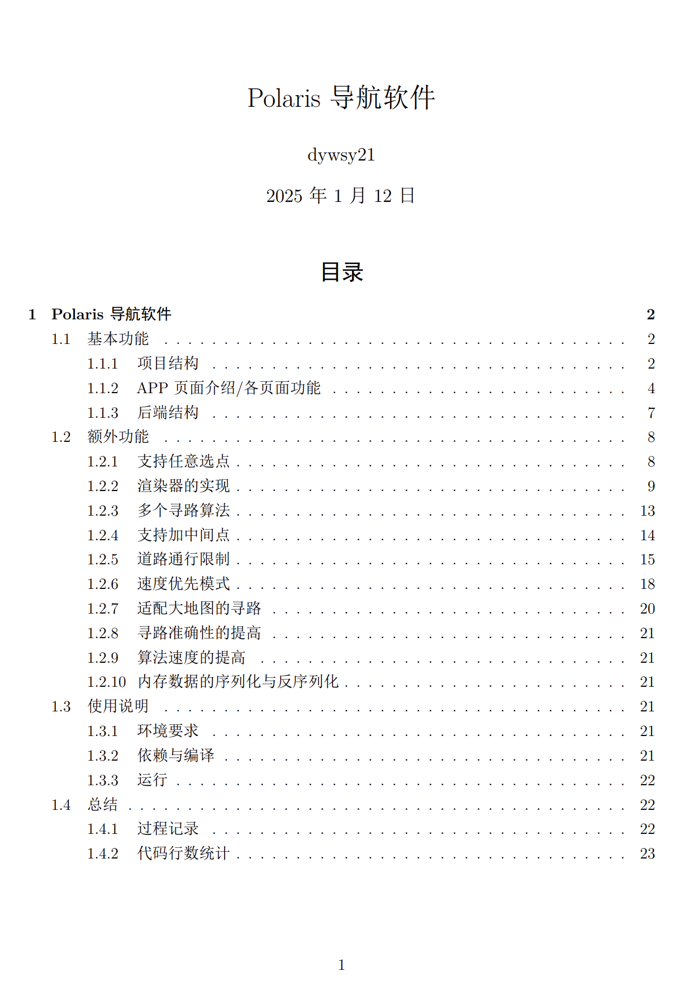
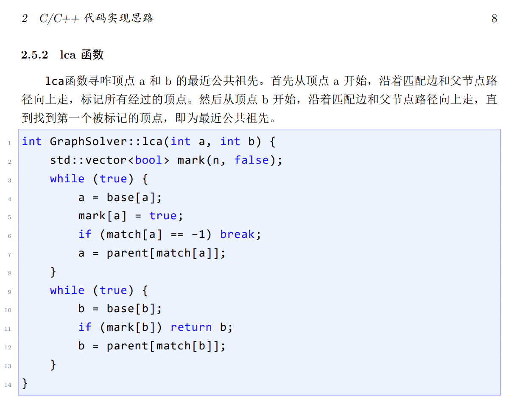
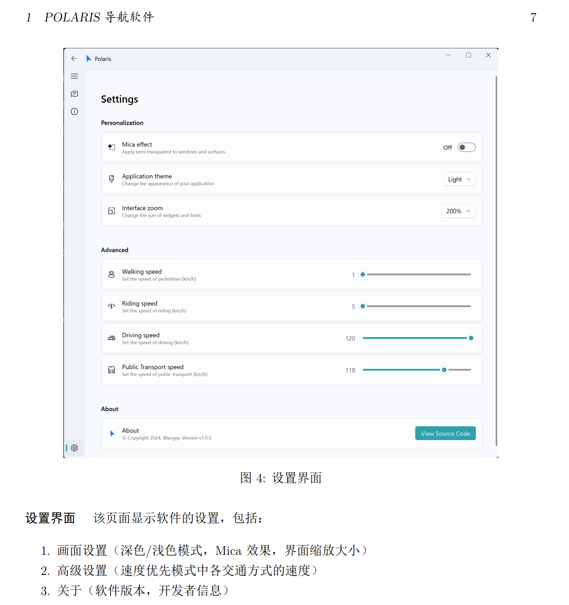
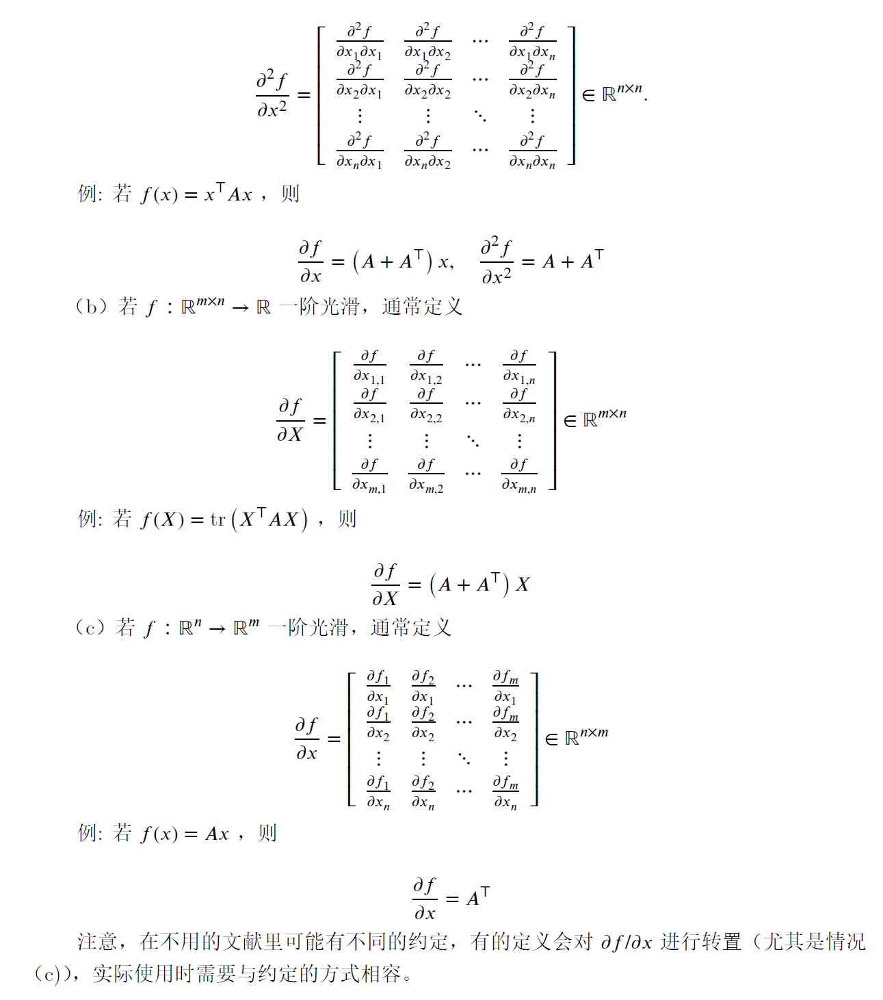
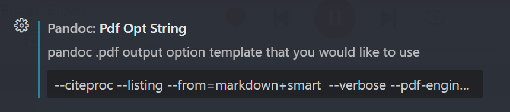

# Pandoc markdown to latex configuration

This repository contains our personal configurations for pandoc's markdown -> latex -> pdf conversion. The configurations include a custom latex template and lua filters for pandoc.

This configuration is especially designed for academic writing, aimed to make writing elegant and aesthetically great papers and reports way easier and much more efficient: **it has full support over Chinese characters and latex math formulas.**

You can find the custom template latex file in "custom template/", and filter scripts in "lua filters/".

Check out "examples/" folder or "README.pdf" in this repo's root (this is the pdf version of this README file generated using this repo's configuration!) for examples of markdown files and the corresponding PDF files generated by this configuration. In case you could not be bothered to check it out, here are some snapshots demonstrating the aesthetics of the generated PDF files:






We recommend using the VSCode extension [vscode-pandoc](https://marketplace.visualstudio.com/items?itemName=ChrisChinchilla.vscode-pandoc) for markdown editing and conversion.

## Usage

This usage tutorial is aimed at using vscode-pandoc to convert markdown files to pdf. If you are using other tools, you may need to adjust the configurations accordingly.

### Configuration

1. Install pandoc and latex. Make sure "pandoc" and "xelatex" executables are in your PATH.
2. Clone this repository, or download the files in "custom template/" and "lua filters/". Put them into fixed locations on your computer and take notes of the paths.
3. Find this configuration entry in vscode-pandoc's settings:


Fill in the configuration as follows:

```
--citeproc --listing --from=markdown+smart  --verbose --pdf-engine=xelatex --pdf-engine-opt="-shell-escape" --template="path\to\custom-template.tex" --lua-filter="path\to\image-wrapper.lua" 
```

Replace `path\to\custom-template.tex` and `path\to\image-wrapper.lua` with the actual paths on your computer.

### Conversion

1. Open the markdown file you want to convert in VSCode and add this yaml header at the beginning of the file:

```yaml
---
title: "Your Document Title"
author: "Author"
date: \today
using_title: true
using_table_of_content: true
---
```

This yaml header is intended to allow users have more control over the generated PDF file. You can set `using_title` to `false` to disable the title page, and set `using_table_of_content` to `false` to disable the table of content. Change the values of `title` and `author` to your own. If you want to use a different date, you can change `\today` to the date you want.

You may notice that this `README.md` file also has a yaml header. We use our own configuration to generate the pdf version for this file as well. Check it out!

It is recommended that you add this yaml header to VSCode's user snippet so that you can easily insert it by typing a keyword. You can add the following code to your markdown user snippet:

```json
	"yaml_header":{
		"prefix": ["header", "yaml"],
		"body": [
			"---",
			"title: \"Your Document Title\"",
			"author: \"Author\"",
			"date: \\today",
			"using_title: true",
			"using_table_of_content: true",
			"---",
			"",
			"",
		],
		"description": "YAML header for pandoc pdf conversion."
	}
```

In this way, you can insert the yaml header by typing `header` or `yaml` and pressing `Tab`.

If typing `header` or `yaml` does not work, it's because VSCode's user snippet for markdown is defaultly disabled. Navigate through the settings and enable it.

2. Hit `F1` to open the command palette, type `pandoc` to find the command `Pandoc Render`, choose `pdf` option. The conversion will start and the PDF file will be generated in the same folder as the markdown file with the same file name.

## Known issues

Feel free to open an issue if you encounter any problem. Here are some known issues and solutions:

### VSCode pops up a "stderr: ..." error message after conversion

The error message is actually harmless (contains some warnings that are actually irrelevant) and does not affect the final PDF file. You can safely ignore it.

When you see the error message popping up, it means the conversion is done and the PDF file is ready.

However, if you see an "Exec error: ..." error box, it means the conversion has failed. In this case, you need to check the error message and try to fix the issue. If you cannot fix it, you can open an issue in this repository. Such failure is usually caused by incorrect markdown syntax / incorrect configuration / incorrect file path.

Generally, if the conversion failed, copy the message from the "Exec error: ..." error box and paste it in the issue you open. This will help us to diagnose the problem.

### Some programming languages are not supported by the syntax highlighter

We use the `listings` package in latex to highlight code blocks where most main stream programming languages are supported. If the programming language you are using is not supported by `listings`, you can add the language manually or just remove the `language` attribute in the code block as a compromise. After all, the only thing you'll lose is the syntax highlighting.

### Images are displayed in the wrong place

This is a known issue with latex and not introduced by either the template nor pandoc itself.

To fix this, you need to make sure that in the original markdown file, **the line immediately above the image insertion is not empty.**

Through making sure some texts precede the image, you can have full control upon where the image is placed in the final PDF as the texts will be placed in the same place as in the markdown file.
